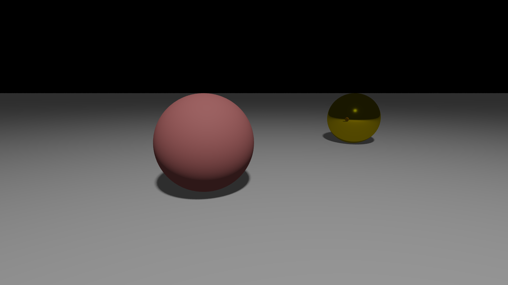

# 🦀 Rayst - A Simple Rust Raytracer



## Why This Project?

I got tired of C++ and decided to switch to Rust. To properly learn the language, I implemented a small raytracer from scratch.

This project's sole purpose is to learn Rust - there probably won't be much evolution afterward.

## Features

- ✨ Basic ray tracing with reflections
- 🎯 Supported geometries: spheres, planes, cubes, pyramids
- 💡 Point lights with shadows
- 🌫️ Soft shadows (area light approximation)
- 🎨 Materials: plastic, metal, gold
- 🖼️ Configurable anti-aliasing
- ⚡ Parallelized rendering with Rayon
- 📝 TOML configuration files

## Usage

```bash
# Build
cargo build --release

# Render with example scene
cargo run scenes/example.toml

# Or directly
./target/release/rayst scenes/example.toml
```

## Configuration

Edit `scenes/example.toml` to customize your scene:

```toml
[camera]
position = [1.0, 1.0, 0.0]
direction = [0.0, -0.2, -1.0]
fov = 60.0

[render]
width = 1920
height = 1080
antialiasing = 8

[[objects]]
object_type = "sphere"
position = [0.0, 0.0, -5.0]
radius = 1.0
[objects.material]
material_type = "gold"
```

## Tech Stack

- **Rust** 🦀 (obviously)
- **Glam** - Vector math
- **Rayon** - Parallelization
- **Image** - PNG export
- **Serde + TOML** - Configuration parsing

## Learning Goals ✅

- [x] Ownership & borrowing
- [x] Traits & generics
- [x] Error handling
- [x] Modules & crates
- [x] Parallel programming
- [x] TOML parsing

---

_A small project to discover Rust after years of C++. Mission accomplished!_ 🎉
